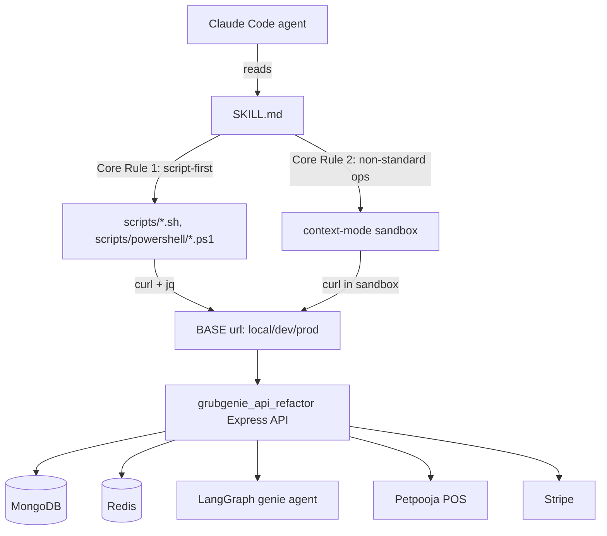

# Overview

## What this is

This wiki documents **`grubgenie-api-test`**, a Claude Code skill that gives an agent ready-to-run bash/PowerShell scripts and curl patterns to exercise the **GrubGenie** food-ordering backend API (partner/diner/admin flows, POS integration, payments, the LangGraph "genie" agent) across local, dev, and prod environments.

The skill has two halves that this wiki treats as one subject:

1. **The skill itself** — `SKILL.md`, the helper scripts in `scripts/`, and the deep-dive docs in `references/` (the primary subject of this wiki).
2. **The API it tests against** — the real backend at `~/Desktop/grubgenie_api_refactor` (Express/TypeScript, MongoDB, Redis, BullMQ, LangGraph). The wiki captures just enough of its architecture and route surface for the skill's docs to stay grounded and accurate — see [Backend API Architecture](./architecture/backend-api-architecture.md).

**Known drift**: the skill's `references/api_reference.md` was compared against the live backend source and found to have several stale/missing spots (webhook path prefix order, a possible base-port mismatch, a large undocumented `/v1/admin/genie/*` surface). See [API Reference & Drift](./modules/api-reference.md) for the full diff and [Sync Skill With Backend Changes](./guides/sync-skill-with-backend-changes.md) for how to close it.

## Architecture at a glance

## Navigation

### Architecture
- [Skill Architecture](./architecture/skill-architecture.md) — how `SKILL.md`, `scripts/`, and `references/` fit together
- [Backend API Architecture](./architecture/backend-api-architecture.md) — the target Express backend's shape

### Modules
- [Bash Scripts](./modules/scripts-bash.md)
- [PowerShell Scripts](./modules/scripts-powershell.md)
- [API Reference & Drift](./modules/api-reference.md)
- [Auth & Security](./modules/auth-security.md)
- [Petpooja POS Integration](./modules/petpooja-pos.md)
- [Debugging & Context-Mode Patterns](./modules/debugging-context-mode.md)

### Flows
- [Dine-In + Pay E2E](./flows/dine-in-pay-e2e.md)
- [Order Approval / Rejection](./flows/order-approval-rejection.md)
- [Petpooja Webhook Callbacks](./flows/petpooja-webhook-callbacks.md)

### Concepts
- [Environments & BASE URL](./concepts/environments-and-base-url.md)
- [Auth Tokens & JWT](./concepts/auth-tokens-and-jwt.md)
- [Script-First Methodology](./concepts/script-first-methodology.md)
- [Cart & Order Lifecycle](./concepts/cart-order-lifecycle.md)
- [Known Test Data](./concepts/known-test-data.md)

### Guides
- [Add a New API Flow](./guides/add-a-new-api-flow.md)
- [Sync Skill With Backend Changes](./guides/sync-skill-with-backend-changes.md)
