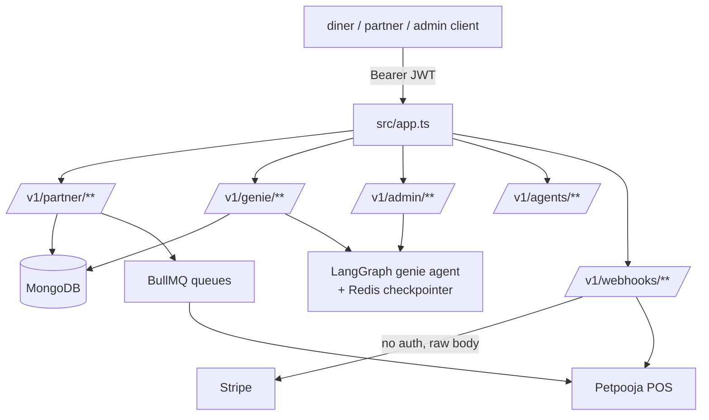

## Summary

The backend under test lives outside this skill's repo, at `~/Desktop/grubgenie_api_refactor` — an Express 4 / TypeScript service (`grubgenie` v2.0, Node 24). Entry point `src/index.ts` → `src/app.ts`. All API routes mount under `/v1`, grouped by domain in `src/routes/v1/{admin,agents,genie,partner}/**`; inbound webhooks are a separate tree at `src/webhooks/v1/**`. Persistence is MongoDB (Mongoose) + Redis; background work runs through BullMQ. The backend also hosts a LangGraph-based "genie" AI agent module and an MCP tool-calling server.

This page exists so the skill's docs stay grounded in the real route surface — see [API Reference & Drift](../modules/api-reference.md) for the diff between what the skill documents and what the code actually exposes.

## Diagram

## Key components

- `src/app.ts` — route mounting, CORS (`*.grubgenie.ai` + `dev-genie` origins), dev-only `/v1/test` routes gated on `NODE_ENV`.
- `src/config/config.ts` — Joi-validated env vars via `dotenv/config`. **Default `PORT=3002`**, not `3000` — the skill's `env.sh`/`SKILL.md` assume local runs on `3000`; verify against the actual `.env` in use (see [API Reference & Drift](../modules/api-reference.md)).
- `src/config/roles.ts` — role → rights map for `partner` / `diner` / `superAdmin`, enforced per-route via `auth(permissions.x.y)` middleware. See [Auth & Security](../modules/auth-security.md).
- `src/routes/v1/{admin,agents,genie,partner}/**` — domain route trees.
- `src/webhooks/v1/**` — Stripe / Petpooja / Meta / PostHog inbound callbacks, mounted at `/v1/webhooks/**` (note the prefix order — `v1` before `webhooks`).
- LangGraph "genie" module — signal-based session/thread state with a Redis checkpointer; a `/v1/admin/genie/*` admin console (fleet/sessions/threads/chat/signal/end) was added very recently (commits `e3d7ee65`, `229e535d`, `af11160e`, all 2026-07-13/14) and is not yet documented anywhere in this skill.

## Design decisions

- Webhooks live in a separate route tree (`src/webhooks/v1`) from the versioned API (`src/routes/v1`) so inbound provider callbacks (no auth, raw body) aren't gated by the same auth middleware stack as authenticated API routes.
- Dev-only diagnostic/test routes are gated by `NODE_ENV` rather than a separate build target.
- Auth is JWT-bearer via Passport (`passport-jwt`, `ExtractJwt.fromAuthHeaderAsBearerToken()`), with a separate Basic-auth strategy reserved for internal admin proxies (`/mongo-express`, `/queuedash`).

## Related

- [API Reference & Drift](../modules/api-reference.md)
- [Auth & Security](../modules/auth-security.md)
- [Petpooja Webhook Callbacks](../flows/petpooja-webhook-callbacks.md)
