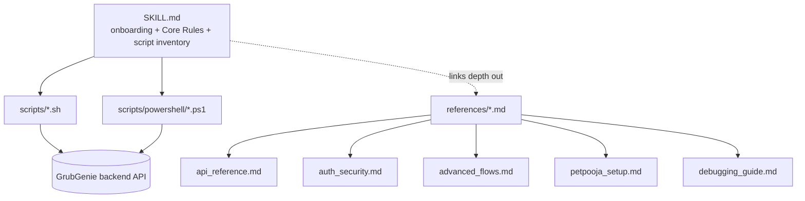

## Summary

The skill is a flat bundle — no build step, no package manager. `SKILL.md` is the contract an agent reads first; it encodes two hard rules (script-first, context-mode-sandbox for anything non-standard) that keep the agent from hand-rolling curl against a live API. `references/` holds depth `SKILL.md` deliberately keeps out of its own body. `scripts/` is the executable surface: one script per API operation or E2E flow, bash-first with a partial PowerShell mirror.

## Diagram

## Key components

- [SKILL.md](../../../SKILL.md) — frontmatter (`name`, `description` used for skill discovery; `allowed-tools`) + onboarding steps for macOS/Linux/Windows + Core Rules + script inventory table + common workflows + a "Key API Facts" cheat sheet.
- `references/*.md` — five deep-dive docs, each orphaned from `SKILL.md` by design (linked only by convention, not by markdown link): [api_reference.md](../modules/api-reference.md), [auth_security.md](../modules/auth-security.md), advanced_flows.md (folded into [Order Approval/Rejection](../flows/order-approval-rejection.md) and [Petpooja POS](../modules/petpooja-pos.md)), [petpooja_setup.md](../modules/petpooja-pos.md), [debugging_guide.md](../modules/debugging-context-mode.md).
- `scripts/*.sh` + `scripts/powershell/*.ps1` — see [Bash Scripts](../modules/scripts-bash.md) and [PowerShell Scripts](../modules/scripts-powershell.md).
- [README.md](../../../README.md) — GitHub-facing install/usage doc (separate audience from `SKILL.md`, which is agent-facing).
- `REFACTOR_SUMMARY.md` / `COMPLETION_REPORT.md` — historical record of a prior refactor pass (dated in the doc as "May 13, 2026"; reduced `SKILL.md` 650→296 lines at the time, since regrown to 671 as POS/multi-env features were added).

## Design decisions

- **Script-first over ad-hoc curl** — every standard operation has a pre-built script so token extraction, request formatting, and error handling stay consistent across sessions (`SKILL.md` Core Rule 1). See [Script-First Methodology](../concepts/script-first-methodology.md).
- **Non-standard ops routed through context-mode, not manual curl** — keeps large HTTP responses out of the agent's context window (Core Rule 2).
- **Bash is the reference implementation; PowerShell only mirrors the 5 highest-traffic scripts** (`env`, `auth`, `create_cart`, `order_item`, `flow_dine_in_pay`) — full parity across all 14 bash scripts was not attempted.

## Related

- [Bash Scripts](../modules/scripts-bash.md)
- [PowerShell Scripts](../modules/scripts-powershell.md)
- [Script-First Methodology](../concepts/script-first-methodology.md)
- [API Reference & Drift](../modules/api-reference.md)
