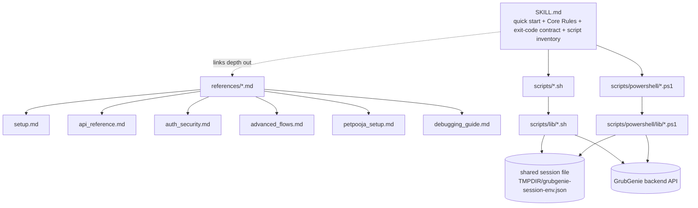

## Summary

The skill is a flat bundle — no build step, no package manager. `SKILL.md` is the contract an
agent reads first; it encodes the script-first rule, the exit-code contract, and the
context-mode-sandbox rule for anything non-standard. `references/` holds depth `SKILL.md`
deliberately keeps out of its own body (this pairing is itself why `SKILL.md` had to be
re-consolidated in July 2026 — reference content had crept back into it). `scripts/` is the
executable surface — bash and PowerShell, both built on a shared library architecture with full
parity, not a bash-primary/PowerShell-partial split as before.

## Diagram

```mermaid
flowchart TD
    SKILLMD[SKILL.md\nquick start + Core Rules + exit-code contract + script inventory] --> Scripts[scripts/*.sh]
    SKILLMD --> PS[scripts/powershell/*.ps1]
    SKILLMD -.->|links depth out| Refs[references/*.md]
    Refs --> Setup[setup.md]
    Refs --> ApiRef[api_reference.md]
    Refs --> AuthSec[auth_security.md]
    Refs --> AdvFlows[advanced_flows.md]
    Refs --> Petpooja[petpooja_setup.md]
    Refs --> Debug[debugging_guide.md]
    Scripts --> Lib[scripts/lib/*.sh]
    PS --> LibPS[scripts/powershell/lib/*.ps1]
    Lib --> Session[(shared session file\nTMPDIR/grubgenie-session-env.json)]
    LibPS --> Session
    Lib --> Backend[(GrubGenie backend API)]
    LibPS --> Backend
```

## Key components

- [SKILL.md](../../../SKILL.md) — frontmatter (`name`/`description` for skill discovery,
  `allowed-tools`) + quick start (both languages) + Core Rules including the exit-code contract
  table + script inventory + common workflows + Key API Facts. 260 lines as of this refactor
  (was 670 before, having regrown from an earlier May 2026 pass that cut it 650→296).
- [AGENTS.md](../../../AGENTS.md) — new: a pointer file for tools that read `AGENTS.md` before
  `SKILL.md`. Deliberately does not restate the quick start — that duplication is exactly what
  let `SKILL.md` regrow past its target size once already.
- `scripts/lib/*.sh` + `scripts/powershell/lib/*.ps1` — the shared architecture layer both
  language surfaces are built on; see [Bash Scripts](../modules/scripts-bash.md) and
  [PowerShell Scripts](../modules/scripts-powershell.md) for the module breakdown.
- `references/*.md` — six deep-dive docs: [setup.md](../../../references/setup.md) (new — full
  per-OS onboarding, moved out of `SKILL.md`), [api_reference.md](../modules/api-reference.md),
  [auth_security.md](../modules/auth-security.md), `advanced_flows.md`, `petpooja_setup.md`
  ([Petpooja POS](../modules/petpooja-pos.md)), `debugging_guide.md`
  ([Debugging & Context-Mode](../modules/debugging-context-mode.md)).
- `install.sh` — new: detects the platform's skill directory and symlinks this checkout in.
  Specifically guards against the case where the install target is a *separate git worktree of
  this same repo* (as it is for this project) — installing over it would replace an independent
  checkout with a symlink into the wrong branch, so it no-ops with an explanation instead.
- `evals/` — new: `run_evals.sh`/`run_evals.ps1` offline suite (syntax, house conventions, secret
  gate, PowerShell parity, a local contract-mock server proving bash/PowerShell agree on exit
  codes for identical inputs). Runs with no live API.
- [README.md](../../../README.md) — GitHub-facing install/usage doc (separate audience from
  `SKILL.md`, which is agent-facing).

## Design decisions

- **Script-first over ad-hoc curl** — every standard operation has a pre-built script so token
  extraction, request formatting, and error handling stay consistent (`SKILL.md` Core Rule 1).
  See [Script-First Methodology](../concepts/script-first-methodology.md).
- **One exit-code contract, both languages** — `0`/`2`/`4`/`5`/`6`/`7` mean the same thing in
  bash and PowerShell. Getting this right was the hardest part of the July 2026 refactor: bash's
  `set -e` does not reliably propagate through nested command substitution or through
  `${VAR:?msg}` when an `EXIT` trap is registered (both confirmed bugs, fixed in `lib/http.sh`
  and `lib/log.sh`'s `gg_require`), and PowerShell's `exit` inside a dot-sourced script only
  terminates that script's own scope, not the caller — the two languages needed genuinely
  different mechanisms to reach the same observable contract.
- **Full bash/PowerShell parity, not a partial mirror** — all 16 scripts + the lib layer exist in
  both languages, verified by `evals/offline/06_parity.sh` (blocking) and a cross-language exit-
  code assertion in `07_contract_mock.sh`. The previous architecture mirrored only 5 of 14
  scripts in PowerShell.
- **A session file, not exported shell variables, is the composition primitive** — `eval
  "$(bash auth.sh)"` has no PowerShell equivalent, and `$env:` mutation has no bash-subprocess
  equivalent; a JSON file both languages read/write at the same path does. This is also what
  makes auth genuinely idempotent across process invocations, not just within one script.
- **Non-standard ops routed through context-mode, not manual curl** — keeps large HTTP responses
  out of the agent's context window (Core Rule 3).

## Related

- [Bash Scripts](../modules/scripts-bash.md)
- [PowerShell Scripts](../modules/scripts-powershell.md)
- [Script-First Methodology](../concepts/script-first-methodology.md)
- [API Reference & Drift](../modules/api-reference.md)
