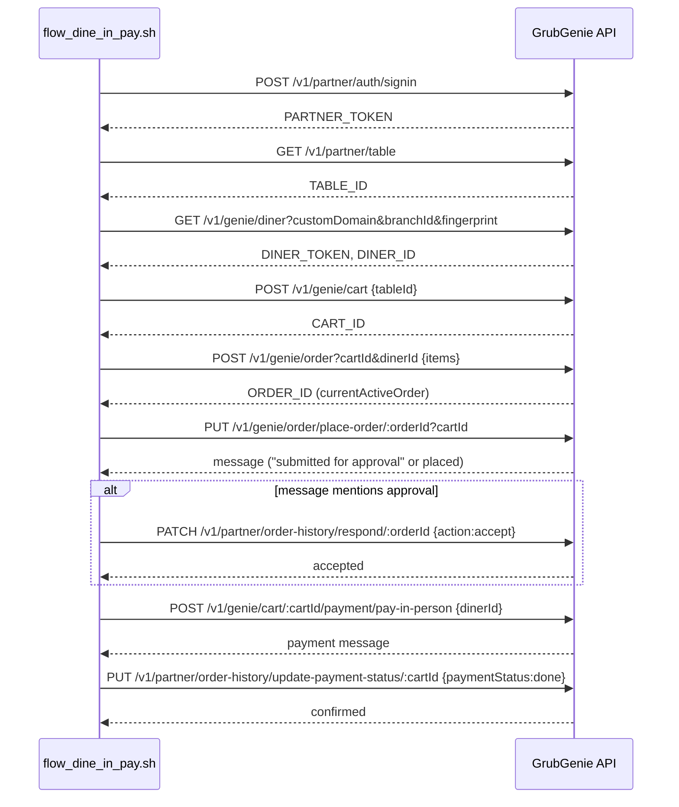

## Summary

The single most-used flow in this skill: authenticate as both partner and diner, create a cart, order an item, place the order, auto-accept it if the branch is in manual-approval mode, pay in person, then have the partner confirm payment. Fully automated by [flow_dine_in_pay.sh](../../../scripts/flow_dine_in_pay.sh) — no env vars required, it does its own auth.

## Trigger

`bash $SKILL/flow_dine_in_pay.sh [itemId] [qty]` (defaults: Ulli Vada `691bf10018f1d3c34db1db00`, qty 2) or the PowerShell equivalent `flow_dine_in_pay.ps1`.

## Sequence diagram

## Steps

1. **Partner auth** — `POST /v1/partner/auth/signin` with test credentials → `PARTNER_TOKEN`.
2. **Get table** — `GET /v1/partner/table`, takes `result[0]._id`.
3. **Diner auth** — `GET /v1/genie/diner?customDomain=munch2&branchId=3XSJT&fingerprint=...` → `DINER_TOKEN` + `DINER_ID`.
4. **Create cart** — `POST /v1/genie/cart {tableId}` → `CART_ID`.
5. **Create order** — `POST /v1/genie/order?cartId&dinerId {items:[{itemId,quantity}]}` → `ORDER_ID` from `result.currentActiveOrder` (not `result._id` — see [Debugging & Context-Mode Patterns](../modules/debugging-context-mode.md)).
6. **Place order** — `PUT /v1/genie/order/place-order/:orderId?cartId`; response message determines if manual approval is needed.
7. **Conditional accept** — if the branch is in `orderAcceptanceMode: "manual"`, script greps the place-order response for "approval" and calls `PATCH /v1/partner/order-history/respond/:orderId {action:"accept"}` automatically. See [Order Approval / Rejection](./order-approval-rejection.md) for the full manual-mode flow.
8. **Pay in person** — `POST /v1/genie/cart/:cartId/payment/pay-in-person {dinerId}`. Sets `serviceFee=0`.
9. **Partner confirms payment** — `PUT /v1/partner/order-history/update-payment-status/:cartId {paymentStatus:"done",paymentMode:"cash",confirmed:true}`.

## Failure modes

- **Payment blocked (400)** if any order in the cart is still `pending_acceptance` — partner must respond to all pending orders first.
- **"Table already has an active cart"** if a prior run left a cart open — run `reset_tables.sh` first.
- **branchId mismatch**: this script hardcodes `branchId=3XSJT`; `auth.sh` (used by other scripts) hardcodes `branchId=D13GZ` for the same diner-auth call — see [Known Test Data](../concepts/known-test-data.md). Running scripts from both origins in the same session can authenticate two different diners without realizing it.

## Related

- [Order Approval / Rejection](./order-approval-rejection.md)
- [Cart & Order Lifecycle](../concepts/cart-order-lifecycle.md)
- [Auth Tokens & JWT](../concepts/auth-tokens-and-jwt.md)
