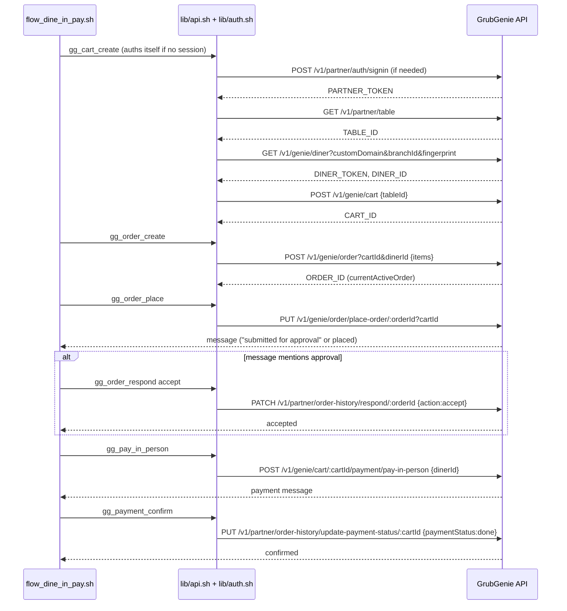

## Summary

The single most-used flow in this skill: authenticate as both partner and diner, create a cart,
order an item, place the order, auto-accept it if the branch is in manual-approval mode, pay in
person, then have the partner confirm payment. Automated by
[flow_dine_in_pay.sh](../../../scripts/flow_dine_in_pay.sh) — self-contained, auths itself via
the shared session (see [Bash Scripts](../modules/scripts-bash.md)).

As of the July 2026 refactor this is ~30 lines of orchestration calling `lib/api.sh` functions,
not inline curl — previously 88 lines that re-implemented `auth.sh`'s own auth logic inline
(the original worst duplication offender in the codebase).

## Trigger

`bash $SKILL/flow_dine_in_pay.sh [itemId] [qty]` (defaults: Ulli Vada `691bf10018f1d3c34db1db00`,
qty 2) or `pwsh $SKILL/powershell/flow_dine_in_pay.ps1 -ItemId <id> -Qty 2` — both produce
byte-identical output for identical inputs (verified in `evals/offline/07_contract_mock.sh`).

## Sequence diagram

```mermaid
sequenceDiagram
    participant S as flow_dine_in_pay.sh
    participant Lib as lib/api.sh + lib/auth.sh
    participant API as GrubGenie API
    S->>Lib: gg_cart_create (auths itself if no session)
    Lib->>API: POST /v1/partner/auth/signin (if needed)
    API-->>Lib: PARTNER_TOKEN
    Lib->>API: GET /v1/partner/table
    API-->>Lib: TABLE_ID
    Lib->>API: GET /v1/genie/diner?customDomain&branchId&fingerprint
    API-->>Lib: DINER_TOKEN, DINER_ID
    Lib->>API: POST /v1/genie/cart {tableId}
    API-->>Lib: CART_ID
    S->>Lib: gg_order_create
    Lib->>API: POST /v1/genie/order?cartId&dinerId {items}
    API-->>Lib: ORDER_ID (currentActiveOrder)
    S->>Lib: gg_order_place
    Lib->>API: PUT /v1/genie/order/place-order/:orderId?cartId
    API-->>S: message ("submitted for approval" or placed)
    alt message mentions approval
        S->>Lib: gg_order_respond accept
        Lib->>API: PATCH /v1/partner/order-history/respond/:orderId {action:accept}
        API-->>S: accepted
    end
    S->>Lib: gg_pay_in_person
    Lib->>API: POST /v1/genie/cart/:cartId/payment/pay-in-person {dinerId}
    API-->>S: payment message
    S->>Lib: gg_payment_confirm
    Lib->>API: PUT /v1/partner/order-history/update-payment-status/:cartId {paymentStatus:done}
    API-->>S: confirmed
```

## Steps

1. **Create cart** (`gg_cart_create`) — auths itself first if no session exists or the existing
   one is stale (>15 min): partner signin → first table → diner auth. All four token/id values
   land in the shared session file, not shell exports.
2. **Create order** (`gg_order_create`) — `POST /v1/genie/order?cartId&dinerId
   {items:[{itemId,quantity}]}` → `ORDER_ID` from `result.currentActiveOrder` (not `result._id` —
   see [Debugging & Context-Mode Patterns](../modules/debugging-context-mode.md)).
3. **Place order** (`gg_order_place`) — `PUT /v1/genie/order/place-order/:orderId?cartId`;
   response message determines if manual approval is needed.
4. **Conditional accept** (`gg_order_respond`) — if the branch is in `orderAcceptanceMode:
   "manual"`, the response message contains "approval" and the script calls `PATCH
   /v1/partner/order-history/respond/:orderId {action:"accept"}` automatically. See
   [Order Approval / Rejection](./order-approval-rejection.md) for the full manual-mode flow.
5. **Pay in person** (`gg_pay_in_person`) — `POST /v1/genie/cart/:cartId/payment/pay-in-person
   {dinerId}`. Sets `serviceFee=0`.
6. **Partner confirms payment** (`gg_payment_confirm`) — `PUT
   /v1/partner/order-history/update-payment-status/:cartId
   {paymentStatus:"done",paymentMode:"cash",confirmed:true}`.

Every step validates its response before proceeding (`gg_json_field` exits 6 on a missing
field) — the previous implementation validated nothing, so a failed signin propagated the
literal string `null` into every downstream URL and header while still reporting success.

## Failure modes

- **Payment blocked (exit 4, HTTP 400)** if any order in the cart is still `pending_acceptance` —
  partner must respond to all pending orders first.
- **"Table already has an active cart"** if a prior run left a cart open — run
  `reset_tables.sh` first.
- **Unreachable API → exit 7**, missing session field → exit 6, bad usage → exit 2. See the
  exit-code contract in [Skill Architecture](../architecture/skill-architecture.md).

**branchId**: previously a real inconsistency — this script used `3XSJT` while `auth.sh` used
`D13GZ` for the same diner-auth call, so running scripts from both origins in one session could
silently authenticate two different diners. Resolved: both now read `GG_BRANCH_ID` from
`lib/constants.sh`, a single canonical `3XSJT`.

## Related

- [Order Approval / Rejection](./order-approval-rejection.md)
- [Cart & Order Lifecycle](../concepts/cart-order-lifecycle.md)
- [Auth Tokens & JWT](../concepts/auth-tokens-and-jwt.md)
