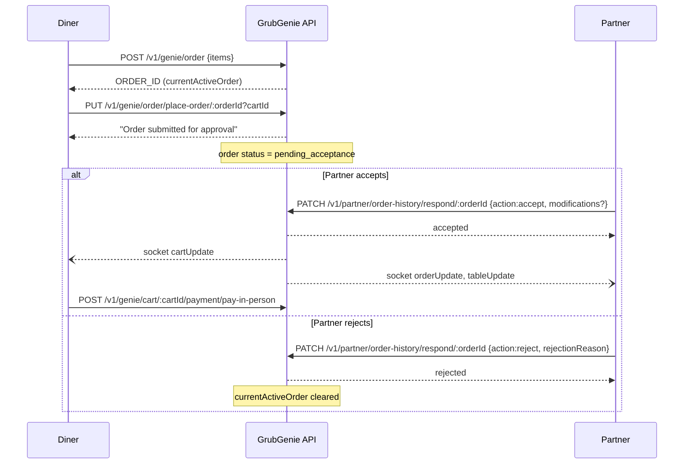

## Summary

When a branch has `orderAcceptanceMode: "manual"`, a placed order lands in `pending_acceptance` instead of going straight to `preparing`. The partner must explicitly accept (optionally with modifications) or reject before the diner can pay. Fully implemented and tested per `references/advanced_flows.md`.

## Trigger

`PUT /v1/partner/branch/update-branch/:branchId {"orderAcceptanceMode":"manual"}` enables it on a branch; then any normal order placement enters this flow instead of auto-preparing.

## Sequence diagram

## Steps

1. Diner creates + places an order as normal ([Dine-In + Pay E2E](./dine-in-pay-e2e.md) steps 5–6).
2. Order lands in `pending_acceptance`; **payment routes are blocked** (400) while any order is in this state.
3. Partner calls `PATCH /v1/partner/order-history/respond/:orderId` with `action: "accept"` (optionally `modifications: [{itemId|comboId, quantity}]`) or `action: "reject"` (requires `rejectionReason`).
4. On accept: `cartUpdate` socket event to diner, `orderUpdate` + `tableUpdate` to partner; diner can now pay.
5. On reject: same socket events fire; `currentActiveOrder` on the cart is cleared.

## Failure modes

| Scenario | Response |
|---|---|
| Diner token on the respond endpoint | `403` (auth correctly blocks — requires `partnerUpdateOrder`, see [Auth & Security](../modules/auth-security.md)) |
| Order not in `pending_acceptance` | `404 "Order not found or not pending acceptance"` |
| `modifications` sent with `action: reject` | `400` validation error |
| `rejectionReason` missing on reject | `400` validation error |
| Branch lacks `dineIn` subscription feature | `403` (subscription middleware, distinct from auth 403) |

## Related

- [Dine-In + Pay E2E](./dine-in-pay-e2e.md)
- [Auth & Security](../modules/auth-security.md) — the `partnerUpdateOrder` permission this endpoint requires
- [Cart & Order Lifecycle](../concepts/cart-order-lifecycle.md)
