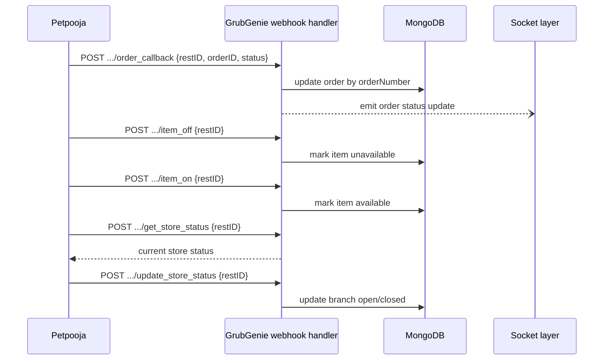

## Summary

Petpooja calls GrubGenie directly (no auth) when order status changes, items are toggled, or store status changes. These are inbound webhooks, not routes an agent calls in normal testing — they're simulated with curl to verify GrubGenie's handling.

**Path drift**: `SKILL.md` and `references/petpooja_setup.md` document these as `$BASE/webhooks/v1/pos/...`. The backend actually mounts webhooks at `/v1/webhooks/**` (prefix order reversed) with a provider segment inserted — e.g. `/v1/webhooks/pos/petpooja/order_callback`. Every curl example below uses the **documented (likely wrong)** path; see [API Reference & Drift](../modules/api-reference.md) before relying on them.

## Trigger

Petpooja's backend POSTs to GrubGenie whenever an order status changes, an item is marked on/off, or a store opens/closes.

## Sequence diagram

## Steps

1. **Order callback** — body `{restID, orderID, status, cancel_reason?}`. `orderID` maps to GrubGenie's `orderNumber` field, not `_id`. Status codes: `-1` cancelled, `1`/`2`/`3` accepted, `4` dispatched, `5` food ready, `10` delivered.
2. **Item on/off** — `{restID}` only; both return `200 OK` when processed, no auth.
3. **Store status** — `get_store_status` (Petpooja queries GrubGenie) and `update_store_status` (Petpooja pushes a change), both `{restID}`.
4. **Outbound direction** (GrubGenie → Petpooja): when an order is placed/accepted, GrubGenie pushes it to Petpooja via the BullMQ `petpoojaOrderPush` queue, async — the placing API call returns before the push completes. `updatePosOrderStatus` also syncs GrubGenie-side status changes (accept/reject/complete) back to Petpooja.

## Failure modes

- **Wrong path** (see Summary) — the documented `webhooks/v1/pos/...` URLs 404 against the real `/v1/webhooks/pos/petpooja/...` mount; verify actual paths from `src/webhooks/v1/**` before trusting these examples.
- **Duplicate POS ID linking** — unrelated to webhooks directly, but linking the same Petpooja `itemId`/`variationId` to two menu items returns `409`, which can surface as a rejected sync.
- **Async push not verified by the API response** — the order-placement call returning success does NOT mean the Petpooja push succeeded; check server logs for `[petpoojaOrderPush]` entries.

## Related

- [Petpooja POS Integration](../modules/petpooja-pos.md)
- [API Reference & Drift](../modules/api-reference.md)
